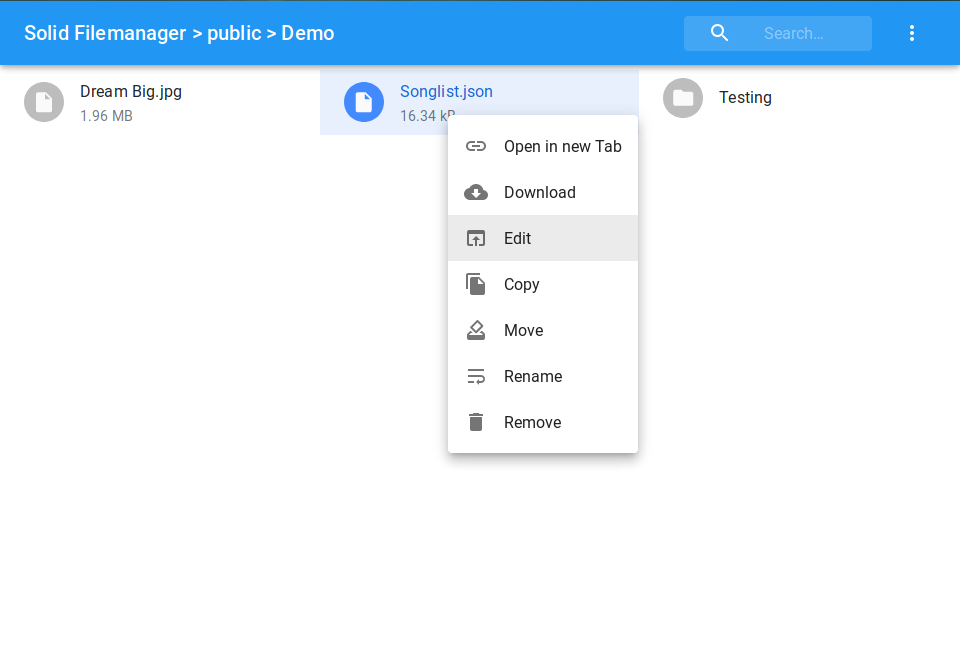

[](http://unmaintained.tech/)

**NOTE**: This project has no active maintainer. It may or may not be working, and from time to time stuff will probably get fixed.

# Solid Filemanager

This is a file manager for solid pods, based on [this awesome react app](https://github.com/joni2back/react-filemanager/).

The app is available here: https://otto-aa.github.io/solid-filemanager/ (see below for more options). To use it you need to have a [solid pod](https://solid.inrupt.com/get-a-solid-pod). If the pod is hosted with a newer server version (5.0.0+) you will need to give this app explicit permission to read/write data to your pod (go to .../profile/card#me -> click on "A" in the top -> Add "https://otto-aa.github.io" with read/write access).

## Features

- Navigation through folders
- Upload files
- Copy, remove, move and rename file and folders
- Edit text files (txt, html, ...)
- View media files (video, audio and image files)
- Zip actions (archive and extract)
- Download files
- Open files in a new tab



## Hosting the app
It's easy to install your own version of this app. This would have the benefit, that it is independent from this repository, but the disadvantage of getting no updates.

1. Go to the [gh-pages](https://github.com/Otto-AA/solid-filemanager/tree/gh-pages) branch
2. Click on the green download button and save the zip file
3. Upload the zip to your pod/server (e.g. with this file manager)
4. Extract the zip file
5. Open the app in a new tab

## Developing
If you want to modify this app, first make sure you've installed git, node and npm. Then enter following commands:

```shell
git clone https://github.com/otto-aa/solid-filemanager/ # Downloads the source
cd solid-filemenager                                    # Enter the directory
npm install                                             # Install dependencies
npm start                                               # Start the development app
# Make changes to the source code now
```

With `npm build` you can create a static build, but keep in mind that logging into your solid pod requires the app to run on a domain or localhost (and not `file:///C:/.../index.html`). So either deploy it (to your pod, etc.) or run it via localhost (e.g. with npm serve).

## Contribute

Feel free to make contributions by adding features, filing issues, fixing bugs, making suggestions, etc.
